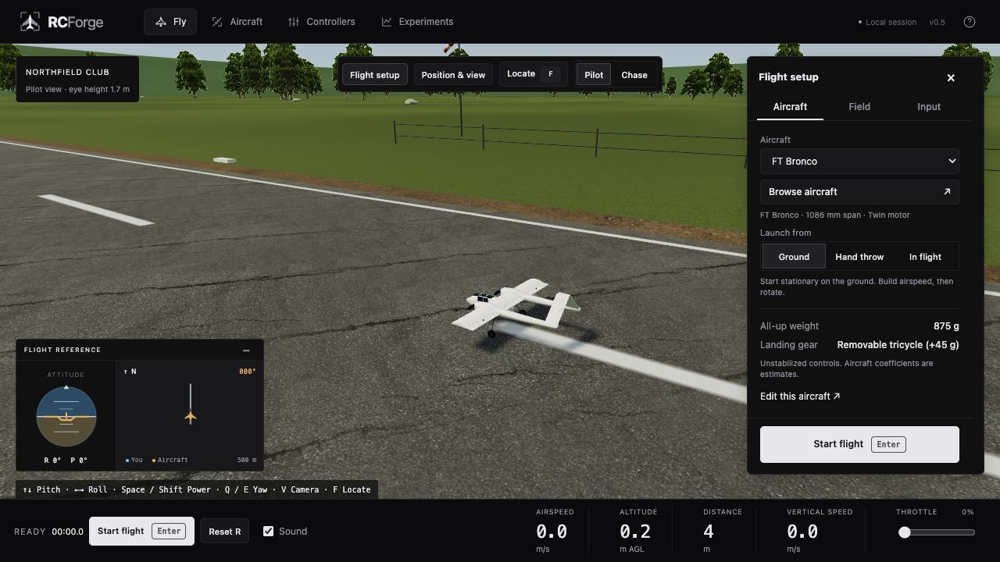
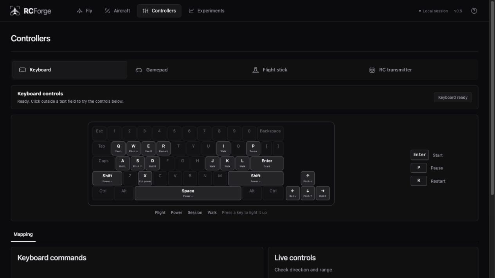

<p align="center">
  
</p>
<h1 align="center">RCForge</h1>
<p align="center"><strong>An open foundation for making RC aircraft programmable.</strong></p>
<p align="center">Build an aircraft. Fly it. Change something. Understand what happened.</p>
<p align="center">
  <a href="https://github.com/adithya-s-k/RCForge/actions/workflows/ci.yml"></a>
  <a href="LICENSE"></a>
  <a href="AGENTS.md"></a>
</p>
<p align="center"><a href="#get-started">Get started</a> · <a href="docs/agent-workflow.md">Build with an agent</a> · <a href="CONTRIBUTING.md">Contribute</a> · <a href="docs/roadmap.md">Roadmap</a></p>

RCForge is an open-source codebase for building and running RC aircraft in a digital environment. Aircraft definitions, physics, controllers, environments and experiments live in ordinary files that you can read, modify and share.

Clone the project, open it with your preferred coding agent or editor, and start building. **The agent works inside RCForge's repository. RCForge itself runs locally without an AI service, account or API key.**

> **Early, experimental software.** The simulator is usable, but its aircraft presets are not calibrated against real flight data. Numerical tests check the implementation; they do not prove that a real aircraft will fly the same way. [Read the fidelity limits →](docs/validation.md)



_The current local workbench. Scenery is illustrative; flight models remain experimental._

## Why RCForge exists

Trying a new RC aircraft usually means finding plans, understanding the construction, choosing electronics, building the airframe and learning to fly it. A design mistake may only become obvious after a crash.

We want a shorter path from an idea to an experiment. Give a coding agent a design reference, have it construct an aircraft in this open environment, then fly, inspect and revise that aircraft. Today, this still requires engineering judgment, explicit assumptions and testing. Making that workflow more capable is the purpose of the project.

**The goal is an extensible foundation.** A community can contribute aircraft, better models, measured component data, new control interfaces and environments. Each useful improvement should become something the next person can build on.

The principles are simple:

- **Aircraft are editable data.** Geometry, components, mass, balance, surfaces and propulsion belong in version-controlled definitions.
- **Agents are external collaborators.** Use Codex, Claude Code, another agent, or your own editor. Keep the project understandable without any particular assistant.
- **Simulation should explain itself.** Keep units, assumptions, provenance and limitations visible. Distinguish plausible behavior from measured agreement.
- **Experiments should be repeatable.** The browser and command-line tools share the same physics core, controls and recording format.
- **Keep the starting point approachable.** Local development, a static browser application, documented extension points and a modest rendering budget.

## Get started

Use **Node.js 24 LTS** and npm. The exact supported Node ranges are in [package.json](package.json); `.nvmrc` also supports the project's Node 22 baseline.

```sh
git clone https://github.com/adithya-s-k/RCForge.git
cd RCForge
npm ci
npm run dev
```

Open the local URL printed by Vite. To choose a port, run `npm run dev -- --port 5180`. Assets are bundled locally; flight does not require a cloud service. `npm run build` produces a static `dist/` directory, and `npm run preview` serves it locally.

New sessions start with the aircraft parked on the runway, throttle at zero, and the pilot standing beside it at 1.7 m eye height. Press **Start flight**, then increase power for takeoff. To begin at altitude instead, choose **Fly → Flight setup → Aircraft → In flight**. Chase follows the aircraft; **Position & view** moves the aircraft and observer. The lower-left instruments show attitude, heading and a minimap.

| Keyboard       | Action                                    |
| -------------- | ----------------------------------------- |
| ↑ / ↓ or W / S | Nose down / up                            |
| ← / → or A / D | Roll left / right                         |
| Q / E          | Yaw left / right                          |
| Space / Shift  | Increase / decrease throttle              |
| V / F          | Switch Pilot/Chase / locate aircraft      |
| X              | Cut throttle                              |
| Enter / P / R  | Start or resume / pause or resume / reset |

Start, pause and reset remain available in the bottom bar when setup is closed. Click the flight view before using shortcuts. Holding a throttle key changes power continuously; releasing it holds the setting. Focus loss pauses flight. [More controls and observer movement →](docs/controllers.md)

## What you can do today

| Area        | Included                                                                                                                                            |
| ----------- | --------------------------------------------------------------------------------------------------------------------------------------------------- |
| Fly         | Ground, hand-launch and airborne starts; ground pilot and chase views; aircraft placement; wind and seeded gusts                                    |
| Aircraft    | FT Bronco with inverted-V/A-tail, FT Tiny Trainer Sport, FT-22 Raptor, a generic trainer, and two Quad X examples                                   |
| Edit        | Component masses and positions, center of gravity, inertia, wingspan, control throws and propulsion; JSON import/export                             |
| Input       | Keyboard, browser-compatible gamepads, flight sticks and RC USB adapters; mapping, reversal, calibration and shortcuts                              |
| Arduino     | Classic Uno/Nano bridge for trainer PPM, receiver PPM or six PWM channels through Web Serial                                                        |
| Scenery     | Club runway, alpine meadow and desert mesa; lightweight vegetation, terrain and lighting                                                            |
| Physics     | Six-degree-of-freedom rigid body, surface forces, approximate stall and propwash, ground contact, multirotor control, optional battery/motor tables |
| Experiments | Headless scenarios, baseline comparisons, telemetry CSV, recordings, replay and numerical verification reports                                      |

The aircraft presets combine referenced dimensions with estimated aerodynamic and component data. The optional electrical model is simplified; scenery collision remains a flat surface. **A convincing picture or a passing test is not flight validation.** The [realism plan](docs/realism-plan.md) documents simulator research, Reynolds-dependent data support, operating-point surveys and the remaining measurement work. See [component models](docs/component-models.md), [reconstruction notes](docs/flite-test-reconstruction.md) and [physics verification](docs/physics-validation.md).

### Use your radio

Choose **Controllers → RC transmitter**. A compatible USB joystick simulator adapter uses **Find devices**; a classic Arduino running the included bridge uses **Connect Arduino** in a Web Serial-capable browser. Calibrate and verify channel directions before flight.

The [FlySky FS-i6 guide](docs/flysky-fs-i6.md) includes transmitter and receiver wiring, the [Uno/Nano sketch](hardware/rcforge_bridge/rcforge_bridge.ino), upload instructions and signal-loss checks. Physical hardware compatibility still needs testing with your exact setup.

<details>
<summary>Preview the keyboard and controller setup</summary>



</details>

## Build with a coding agent

Start with [AGENTS.md](AGENTS.md), then the [agent workflow](docs/agent-workflow.md). The repository includes instructions for finding extension points, validating definitions, testing changes and reporting uncertainty. `CLAUDE.md` points to the same canonical guidance.

For example:

```text
Read AGENTS.md and docs/aircraft-authoring.md. Use the design references
I provide to create a new aircraft definition under aircraft/. Identify
sourced dimensions and mark missing component/aerodynamic data as estimates.
Validate it, run a trim and pitch-response experiment, and show me how
to import it into the browser. Report what remains unverified.
```

A plan PDF is a reference, not a complete flight model. The agent must interpret the assembly, account for components and establish evidence for the model. RCForge does not contain an automatic plan-to-aircraft importer.

## Run repeatable experiments

```sh
npm run aircraft:validate
npm run simulate -- ft-bronco --scenario glide --duration 20
npm run simulate -- ft-bronco --scenario pitch-pulse --battery-shift 0.05 --out results/battery-forward
npm run replay -- results/ft-bronco-glide/recording.json
npm run physics:validate
npm run physics:envelope
```

Scenario runs write a recording, telemetry CSV and summary under `results/`. Numerical verification writes an HTML/JSON report under `results/validation/`. Both are local generated outputs, excluded from Git.

Browser edits do not change repository files: export your aircraft JSON and give that file to the CLI to reproduce an edited design. Recordings require the matching simulation version. [Experiment commands and validation workflow →](docs/physics-validation.md)

## Contribute

Aircraft builders, pilots, developers, artists and people using coding agents are all welcome. A useful contribution can be a reproducible bug, a measured thrust curve, a hardware test report, an accessible control, a documented aircraft or an improvement to a physical model.

Read [CONTRIBUTING.md](CONTRIBUTING.md) for setup, focused pull requests and the review checklist. Start a [GitHub issue](https://github.com/adithya-s-k/RCForge/issues/new/choose) for a bug or proposal. For behavior and attribution expectations, see the [code of conduct](CODE_OF_CONDUCT.md) and [third-party notices](THIRD_PARTY_NOTICES.md).

```sh
npm run check             # Aircraft definitions, tests, TypeScript and build
npm run physics:validate  # Numerical verification, not real-flight validation
npm run format:check
```

## Find your way around

| Path                       | Purpose                                                              |
| -------------------------- | -------------------------------------------------------------------- |
| [`aircraft/`](aircraft/)   | Versioned aircraft definitions                                       |
| [`src/core/`](src/core/)   | Browser-independent dynamics, schema, mass properties and recordings |
| [`src/input/`](src/input/) | Input acquisition and normalization                                  |
| [`src/view/`](src/view/)   | Three.js scene and SVG instruments                                   |
| [`src/app/`](src/app/)     | Editors, calibration, placement and application UI                   |
| [`scripts/`](scripts/)     | Shared-core CLI experiments and verification                         |
| [`hardware/`](hardware/)   | Arduino input bridge                                                 |
| [`docs/`](docs/README.md)  | Architecture, aircraft authoring, hardware and validation guides     |

## License and credits

RCForge code and original aircraft parameterizations are [MIT licensed](LICENSE). Bundled assets and elevation data retain their respective terms and credits in [THIRD_PARTY_NOTICES.md](THIRD_PARTY_NOTICES.md) and the [scenery manifest](public/scenery/README.md).

The FT Bronco, Tiny Trainer and FT-22 Raptor are credited to their original Flite Test designers. Original plan PDFs and reference photographs are not bundled. RCForge is an independent project, with no affiliation or endorsement implied by aircraft or hardware names.
