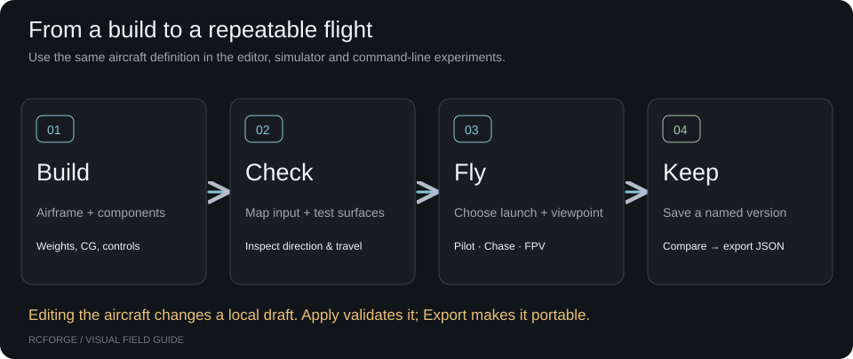

# RCForge documentation

Build, fly and refine RC aircraft in an open, local-first workbench. Aircraft,
components and experiments are editable files. Use your preferred editor or coding
agent; RCForge needs no AI service or account.

## Start flying

1. [Install & first flight](getting-started.md) — run the workbench and take off.
2. [Controls & calibration](controllers.md) — set up a keyboard, gamepad or radio.
3. [Connect a radio](radio-setup.md) — illustrated Arduino wiring and an agent setup prompt.
4. [Edit & save an aircraft](aircraft-editor.md) — change components and keep versions.

The simulator and these docs build into one static website. Open **Docs** in the
workbench header, or visit `/docs/` on your local or hosted address.

## Build an aircraft

Use [aircraft definitions](aircraft-authoring.md) for geometry and physical
contracts, [components & batteries](component-models.md) for mass and power, and
[FPV, rates & mixing](fpv-and-control-setup.md) for cameras and control response.
The [quadcopters guide](multirotors.md) covers rotor layouts and controllers.

[Plans & design credits](plans.md) connects the bundled aircraft to their creators,
source plans and version-matched JSON files. Download verified originals for local
inspection without adding their artwork to a public build.

## Contribute

Follow the [contribution workflow](../CONTRIBUTING.md) from fork to pull request.
Read [architecture](architecture.md) for code boundaries or the
[agent workflow](agent-workflow.md) for a guided aircraft implementation.
Run [physics checks](physics-validation.md) when changing behavior.

Maintainers can find [versions & aircraft history](versioning.md),
[release & hosting](deployment.md), and [documentation maintenance](documentation.md)
in the Develop section. Technical reconstruction notes, wiring, sources and
community policies are grouped under Reference.

## Understand the limits

The bundled aircraft are engineering approximations. A realistic model or a
passing numerical test does not establish real-aircraft fidelity. See
[model limits & evidence](validation.md) for exactly what is covered and what
requires measured bench or flight data.

The documentation selector separates current development from explicitly frozen
releases. Each page identifies the application, physics and aircraft format
versions it describes. No historical release documentation is fabricated.
