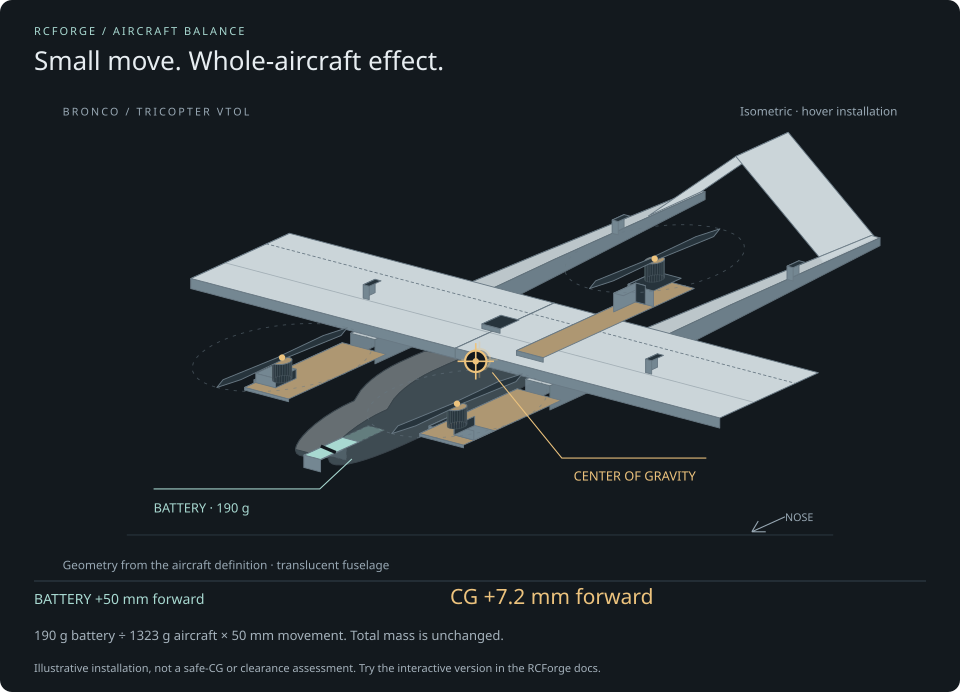

# Edit & save an aircraft

The aircraft editor changes a complete local aircraft definition: shape, component
mass and position, propulsion, battery, controls and FPV equipment. Repository JSON
stays unchanged until you export it and edit the file yourself.

## A useful editing loop

1. Choose an aircraft, then **History → Save version** and name the starting setup.
2. Change one thing in **Airframe**, **Components** or **Control test**.
3. Check mass, CG and visible installation. Inspect Top and Side views as well as Perspective.
4. **Apply & fly** to try it, or open **Experiments** and run a comparison.
5. Keep the result as a named version, or restore your earlier checkpoint.

## Mass and center of gravity

Try the battery slider in this guide: the highlighted pack and gold CG marker move together. The readout uses the Bronco VTOL component ledger. This demonstration stays separate from your aircraft; use **Components → Move on model** to change an actual editor draft.

**Aircraft mass** is the sum of its installed parts. Editing total mass scales
those masses; for a real component substitution, edit that component instead.
**CG aft of LE** is the longitudinal center of gravity measured from the main
wing leading edge. The CG editor moves the battery to reach the requested balance.
The resulting full inertia tensor follows each component's mass and position.

Positions use body axes: **X forward, Y right, Z down**. Coordinates are relative
to the aircraft's fixed datum. The simulator's position refers to the center of
mass. Positive Z moves a component downward.

## Change components

In **Components**, select the battery, motor, servo or payload. Choose a catalog
replacement and review its mass and performance before applying it. Enter measured
values for your build when available.

| Component             | Values that affect the model                                                           |
| --------------------- | -------------------------------------------------------------------------------------- |
| Battery               | Mass, position, cells, capacity, initial charge, voltage curve and internal resistance |
| Motor and prop        | Mass, position, paired thrust/current table, response time and torque assumptions      |
| Servo                 | Mass, installation, commanded travel, rated speed and linkage geometry                 |
| Structure and payload | Mass, position, dimensions and optional principal inertia                              |

Material names and servo torque ratings do not automatically calculate structural
flexibility or loaded servo behavior. Prop diameter alone does not derive motor
thrust. [Component models](component-models.md) describes what is calculated and
what remains descriptive.

## Check control movement

Open **Control test** and enable **Test sticks**. Move the keyboard or configured
controller and inspect the physical surface deflections. Adjust response rates,
expo, servo travel and per-surface mixing as needed. The same actuator model drives
the preview and flight.

The Bronco V-tail mixes pitch and yaw into two ruddervators; its conventional
configuration has fixed fins, one elevator and differential motor yaw. The FT-22
uses mixed elevons. The Simple Trainer has rudder/elevator control and no ailerons.
Avoid applying the same mix in both your transmitter and RCForge.

## Place an FPV camera

Add a camera in **Components**, then choose **Adjust camera**. Use the interactive
mount tool to position it on the aircraft, inspect its lens preview, adjust tilt
and field of view, and accept the placement. The installed camera has mass and
moves with the aircraft. [FPV and control setup](fpv-and-control-setup.md) has the
complete workflow and field definitions.

## Save, restore and contribute

**Apply to flight** saves an automatic version when the setup changes. **History**
compares complete snapshots and restores a version to your draft before you apply
it. **Restore original aircraft** loads the bundled source while preserving the
previous draft as a checkpoint.

Export ordinary aircraft JSON to share one setup, or export a history archive to
keep all local revisions. Before reloading, apply, save or export unapplied drafts.
See [versions and recovery](versioning.md) for storage limits, and
[contributing](../CONTRIBUTING.md) to submit an aircraft to the public catalog.

## Place components on the model

Choose a part by its icon and name, then **Move on model**. Drag the body-axis handles or enter X/Y/Z in millimeters. **Top** and **Side** views help check clearance. The gold CG marker and live balance readout show the effect immediately. **Cancel** keeps the previous draft; **Use placement** writes the position into the draft. Apply when ready to save a local version.

Moving a motor or propeller keeps the paired components and motor force station together. Other installed parts move independently. The editor does not enforce collisions or fabricate a new structural or aerodynamic shape. For the [tricopter VTOL](bronco-vtol.md), **Check motor headroom** reports calculated hover motor commands after a placement change.
