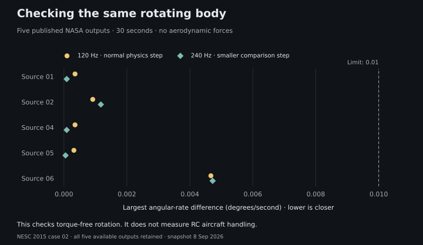

# How we check the flight simulation

RCForge has repeatable checks for gravity, rotation, control inputs and flight
calculations. We also compare parts of the engine with JSBSim and published NASA
reference results. Those checks help us find mistakes in the software.

**We have not yet shown that each preset flies like its real-world counterpart.**
The aircraft still contain estimated aerodynamic and propulsion parameters. This
page explains the evidence we have, the problems it exposed, and what remains open.

## The current results

This is a **September 8, 2026** snapshot for simulation **0.8.1**, covering nine
aircraft definitions. It is a dated result, not a live status badge. You can
[download the numbers, limits and source hashes](benchmarks/2026-09-08.json) or
inspect the [tested source revision](https://github.com/adithya-s-k/RCForge/tree/2ce1fa5800b6b34dfc74d67abefa9a698c05e8d1).

| Question                                                        | What we checked                                                                     | Result                                                | What that tells us                                                                |
| --------------------------------------------------------------- | ----------------------------------------------------------------------------------- | ----------------------------------------------------- | --------------------------------------------------------------------------------- |
| Does the software behave consistently?                          | Definitions, controls, components, recording, replay and browser scheduling         | 406 tests passed across 63 files                      | The tested behaviors are repeatable                                               |
| Do simple physical cases have the right answer?                 | Gravity, drag, rotation, actuators, electrical accounting and numerical convergence | 119 checks passed                                     | The engine agrees with the analytical or numerical reference used in each case    |
| Does another engine calculate the same motion?                  | 56 matched cases in native JSBSim                                                   | 616 comparisons passed                                | The implementations agree under the matched assumptions                           |
| Does rotation agree with published reference data?              | Five NASA outputs over 30 seconds                                                   | Maximum difference: 0.004668 degrees/second at 120 Hz | The torque-free rotational calculation agrees closely                             |
| Can every tested aircraft/condition hold a steady flight state? | 918 combinations of aircraft, air density, mass, speed and battery charge           | 560 trim solutions; 358 not solved                    | Some operating conditions are outside what the current models can trim            |
| Do extreme attitudes produce invalid numbers?                   | A separate 252-case force check across nine aircraft                                | Zero undefined or infinite loads                      | The sampled force calculations stay finite; their accuracy is a separate question |
| Does it match measured flights?                                 | No new bench or flight measurements were supplied                                   | Not established                                       | These numbers are not a real-aircraft accuracy rating                             |

These totals should not be added together or turned into a percentage of realism.
A test can check one small behavior; several comparisons can exercise the same
underlying assumption.

## Start with something we can calculate exactly

Imagine dropping an object with its motors off and all aerodynamic forces removed.
Starting from rest, gravity alone should move it **19.6133 metres in two seconds**,
using 9.80665 m/s². RCForge's difference from that answer was about
**0.0000000000000284 metres**—effectively floating-point rounding for this test.

That tells us the gravity/integration calculation works in this idealized case.
A real airplane also produces lift and drag, so a correct free-fall test cannot
tell us whether a particular airplane glides too well.

Other checks ask whether a freely tumbling body conserves angular momentum and
energy, whether motor response follows the specified lag, whether battery charge
decreases by current × time, and whether replay produces the same state. Each has
its own units and acceptance limit in the downloadable snapshot.

## Compare the same problem with JSBSim

[JSBSim](https://github.com/JSBSim-Team/jsbsim) is a separate flight-dynamics
implementation. We run version **1.3.1** offline as a development tool. It is not
downloaded by the browser and does not replace RCForge's engine.

Both engines receive matching component definitions, initial conditions and test
inputs. An independently written adapter assembles JSBSim's mass distribution,
forces and moments. We compare static loads and short trajectories lasting two
to four seconds, including unpowered flight, free fall, tumbling and moved components.
Two synthetic-wing cases also exercise JSBSim's native aerodynamic axes.

The following are the largest differences across the applicable cases:

| Quantity                          | Largest difference | Acceptance limit |
| --------------------------------- | -----------------: | ---------------: |
| Position                          |           0.370 mm |             5 mm |
| Velocity                          |        0.00239 m/s |        0.005 m/s |
| Attitude, or aircraft orientation |            0.0105° |          0.1146° |
| Angular velocity                  |           0.322°/s |         0.573°/s |

These are differences **between two calculations**. A 0.370 mm difference does
not mean a real aircraft's position is predicted to submillimetre accuracy.

Most matched aircraft cases deliberately use the same simplified aerodynamic
assumptions. This is useful for finding coordinate, unit, force and integration
errors. If both engines receive an inaccurate lift slope, they can agree closely
and still be wrong about the real airplane.

RCForge runs these cases at its normal 120 Hz and again at 240 Hz. JSBSim runs at
3840 and 7680 Hz to check that the reference itself has settled. These high rates
are for offline checks; the browser still integrates at 120 Hz. Earlier reference
runs at lower rates exceeded our convergence limit. Increasing the reference
resolution resolved that disagreement without weakening the limits or changing
the aircraft. [Full method, tolerances and exclusions](physics-reference.md).

## Compare rotation with NASA's published outputs

For another check, we use the tumbling-brick case from
[NASA NESC's 2015 flight-simulation check cases](https://nescacademy.nasa.gov/flightsim/2015/atmospheric/acc02).
Its published mass, inertia and initial rotation give us a problem with externally
generated answers. We retain all five available simulator outputs.



The plotted quantity is the largest three-axis angular-rate difference during
30 seconds, not an average that could hide a large error. Lower is closer to the
reference. The engineering limit is 0.01 degrees/second for this case.

Halving RCForge's timestep reduces the median maximum error to roughly one
quarter. Two reference outputs do not get closer at the smaller step; the
published outputs themselves differ slightly. Those results remain visible.
We do not select only the closest dataset or shift its output to improve the score.

**This checks torque-free rotation only.** NASA's full case uses a rotating Earth
and a gravity model that RCForge's flat local world does not implement. We compare
inertial body angular rates, not that case's translation or local Euler angles.
It is not a full NASA check-case pass or a test of RC airplane aerodynamics.
[Coordinate matching and data checks](physics-validation.md#published-nasa-rotation-reference).

## A bug the checks helped us find

Flight could look slow even when the gravity calculation was correct. The browser
used to limit each frame's contribution to 50 milliseconds. At 15 frames per
second, ten real seconds advanced only **7.5 seconds of simulation**.

The clock now accounts for the elapsed time while keeping the physics step fixed.
Synthetic schedules from 10 to 144 FPS, plus jitter, test that behavior. All nine
aircraft follow identical three-second trajectories at synthetic 15 and 60 FPS.
If a frame stalls for more than a quarter of a second, flight pauses visibly and
requires a resume instead of silently slowing down or processing a long backlog.

In a rendered browser check, roughly 15.1 real seconds advanced the flight display
by 15.2 seconds, within the display's sampling and automation timing resolution.
That is a clock check, not an FPS performance promise. No gravity constant or
aircraft coefficient was changed to conceal the problem.

## Conditions the aircraft cannot currently trim

“Trim” means finding a pitch angle, elevator setting and power level that balance
the forces and pitching moment for a requested steady flight state. Finding that
balance does not prove the aircraft is stable after a disturbance.

We surveyed three field densities, 80/100/120% of the defined mass, and
100/50/15% battery charge. Fixed-wing speeds were 6, 9, 12, 16 and 22 m/s;
quads were checked in hover. VTOL uses hover and cruise at 9, 12, 14, 16 and 22 m/s;
this survey does not validate the transition between those modes.
Mass scaling changes the whole mass ledger; it is a sensitivity test, not a battery swap.

| Aircraft                     | Conditions | Trim solved | Not solved |
| ---------------------------- | ---------: | ----------: | ---------: |
| Bronco tricopter VTOL        |        162 |         107 |         55 |
| FT-22 Raptor                 |        135 |          57 |         78 |
| FT Bronco, conventional tail |        135 |          72 |         63 |
| FT Bronco, V-tail            |        135 |          81 |         54 |
| FT Tiny Trainer Sport        |        135 |          81 |         54 |
| Quad X, 450 mm               |         27 |          27 |          0 |
| Quad X, 5 inch               |         27 |          27 |          0 |
| Quad X, 6S                   |         27 |          27 |          0 |
| Vortex RC Simple Trainer     |        135 |          81 |         54 |

Low airspeed, low available power or an unsuitable balance can prevent a solution.
An unsolved point can also expose a modeling or solver limitation; it is not proof
that a physical aircraft cannot fly there. We keep the unsolved results instead
of reporting “918 passes.”

A separate force check samples four speeds and seven pitch angles, including
backward and vertical attitudes, for each aircraft: 252 cases in total. None
produced undefined or infinite loads. That check is separate from the 918 trim
conditions and does not establish accurate deep-stall behavior.

The FT-22's high modeled elevon trim and full-power pitch response remain known
limitations. Its 57 solved points are not a 42% realism score, and the quads'
27/27 hover solutions do not make them calibrated digital twins.
[FT-22 handling review](flite-test-reconstruction.md#ft-22-trim-and-power-response-review).

## Check the path from your controls to the airplane

Software tests send keyboard events and PPM/PWM serial packets through decoding,
mapping, sensitivity settings, trim, servos, motors, flight dynamics and replay.
They check yaw direction, loss of focus, STOP, timeout and deliberate recovery.
The serial port in these tests is a software stand-in, not a physical Arduino.

The browser review also covered a Tiny Trainer power cut, Bronco ground departure,
Pilot/Chase views, all three fields, missing-controller handling, a CG edit and its
changed experiment trace, visible F-22 elevon trim, and a narrow flight layout.
These establish that the workflows connect; they do not measure handling fidelity.
Physical receiver PPM/PWM connections are still unverified. See
[radio test status](radio-setup.md#connection-test-status).

## What would make the realism claim stronger?

The biggest missing evidence is how the defined aircraft compares with an actual
build: assembled mass and CG, motor/prop thrust, glide descent, stall onset and
response to known control inputs. Matching measurements should include their
uncertainty, the build configuration and flight conditions.

Data used to adjust coefficients should be kept separate from the flights used
to judge the result. Otherwise we could tune a model to one recording and mistake
that fit for a useful prediction. Until that evidence exists, the honest claim is
**tested simulation software with estimated aircraft models**.

## Reproduce the results or challenge them

Start with a supported Node version and the
[optional JSBSim environment](physics-reference.md#run-the-comparison), then run:

```sh
npm ci
npm run check
npm run physics:validate
npm run physics:reference
npm run physics:nasa -- --fetch
npm run physics:envelope
```

The generated HTML/JSON reports are under `results/validation/`. NASA downloads
are checksum-checked; missing dependencies, changed data and failed comparisons
fail their commands instead of silently skipping. GitHub's
[verification workflow](https://github.com/adithya-s-k/RCForge/actions/workflows/ci.yml)
runs the checks and retains reports for 14 days. Check the commit and run status;
the dated snapshot on this page does not assert that every future build passes.

The [downloadable snapshot](benchmarks/2026-09-08.json) includes every numerical
check, maximum JSBSim errors, all five NASA comparisons, survey counts, source
identities and hashes of the full local reports. It is a compact summary, not the
raw trajectories. NASA source links and checksums are retained; original downloads
stay outside the application bundle.

To publish a fresh documentation snapshot, also generate machine-readable test
results and run the summary tool:

```sh
npm test -- --reporter=json --outputFile=results/validation/tests.json
npm run benchmarks:snapshot
```

That tool refuses stale core/aircraft/reference hashes or failed reports. Preserve
older dated snapshots when adding new evidence, and update the text and figure
together. The optional [figure script](../scripts/plot-benchmarks.py) uses
Matplotlib 3.10.7; plotting dependencies are not needed to build or fly RCForge.

Found a mismatch? Share the aircraft definition, starting conditions, inputs,
reference source and reproduction steps in an
[issue](https://github.com/adithya-s-k/RCForge/issues). A specific counterexample
is more useful than a larger test count.
