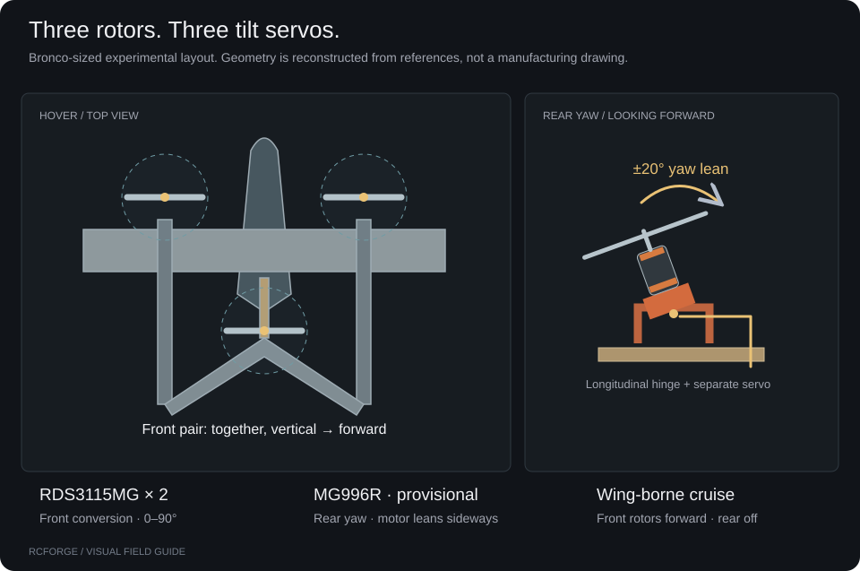

# Bronco tricopter VTOL

The **Bronco · Tricopter VTOL** is an experimental conversion of the Flite Test Bronco layout. Two front motors rotate from vertical lift to forward thrust. A third motor behind the CG tilts **sideways for yaw** and stops in cruise. This is an independent RCForge model, not an official Flite Test VTOL or an ArduPilot firmware simulator.



## First flight

1. Choose **Bronco · Tricopter VTOL**, **Ground**, and **Beginner** in Fly. Start with calm wind.
2. Start flight. Raise throttle above 55% to climb. At rest, centered throttle keeps the motors stopped.
3. At a comfortable height, center throttle in the 45–55% band to hold altitude. On keyboard, **H** sets 50%. Released sticks brake and hold position in Beginner.
4. Above the configured minimum conversion height (5 m by default), request **Cruise**. Use more margin while learning. Front motors first tilt to 45°. Conversion proceeds after forward air-relative speed stays above 12 m/s for one second.
5. In cruise, throttle controls motor power and sticks command bank/pitch angles. Centered pitch targets the configured cruise attitude, **not constant altitude**. The rear rotor fades out as the front motors approach forward flight.
6. Request **Hover** to bring the front rotors upright and brake. Center throttle; allow room and time to decelerate. Lower it gently to descend and land.

**Zero throttle cuts all motors**, including in hover. This differs from an ArduPilot QHOVER throttle stick at its lower endpoint. A simulated flight is not evidence that a physical conversion can safely fly.

If conversion is requested too low, select Hover and then request Cruise again after climbing. RCForge does not queue a surprise conversion. Failure to establish conversion within the configured timeout, or dropping below 1 m during conversion, requests a return to hover. The controller cannot recover height without sufficient thrust.

## Controls on each device

| Action                   | Keyboard                         | Standard gamepad defaults          | RC transmitter / flight stick                             |
| ------------------------ | -------------------------------- | ---------------------------------- | --------------------------------------------------------- |
| Roll / pitch / yaw       | Arrows or WASD; Q / E yaw        | Calibrated axes shown on screen    | Calibrated roll, pitch and yaw channels                   |
| Climb / descend in hover | Space increases; Shift decreases | Mapped throttle axis               | Throttle stick; center to hold altitude                   |
| Set 50% throttle         | H                                | Center mapped throttle             | Center throttle stick                                     |
| Hover ↔ Cruise           | T                                | R1 / RB                            | Bind a switch to Hover and Cruise                         |
| Beginner ↔ Intermediate  | B                                | Share / View                       | Bind an assistance shortcut or use the on-screen selector |
| Start / pause / restart  | Enter / P / R                    | Existing on-screen named shortcuts | Bind available buttons in Controllers → Shortcuts         |

Existing saved controller mappings are preserved. **Use standard shortcuts** installs the gamepad defaults. A custom USB adapter does not necessarily use standard gamepad button numbers; watch the live signals and bind its actual inputs.

For an FS-i6 with the [Arduino serial bridge](radio-setup.md), keep CH1–4 as the four flight controls. In **Controllers → Shortcuts**, **Use CH5 for Hover / Cruise** binds the two endpoints of the fifth axis. It is unavailable if that axis is already a flight control. Check which switch direction produces each state. **CH6 remains the bridge RUN guard**; it is not available for another shortcut. Set the guard off, connect and verify, then explicitly enable it. The bridge supplies normalized simulator input, not actuator output to physical motors or servos.

## Configure assistance and mechanisms

**Aircraft → Airframe → Tricopter VTOL** exposes both profiles. Defaults:

| Setting                           | Beginner | Intermediate |
| --------------------------------- | -------- | ------------ |
| Bank limit                        | 18°      | 35°          |
| Pitch limit                       | 12°      | 22°          |
| Yaw rate                          | 45°/s    | 90°/s        |
| Climb / descent limit             | 2 m/s    | 4 m/s        |
| Horizontal speed in position mode | 4 m/s    | 8 m/s        |
| Brake and hold position           | On       | Off          |

Intermediate hover commands attitude and can drift. Both profiles retain the altitude controller around centered throttle. Position hold can be configured independently of the profile name. Front conversion rate, minimum height, airspeed gate, timeout, rear yaw travel, cruise trim and controller gains are editable. Rates/expo still shape pilot commands before assistance. These gains are simulation settings, not transferable flight-controller tuning.

Use **Control test** to check mechanisms without spinning motors: yaw moves the rear mount; Hover/Forward preview moves both front mounts together. Actual travel is limited by the three installed servo models. Control surfaces retain their separate servo/linkage definitions and V-tail mixing.

## Components, placement and balance

The preset has **34 mass entries totaling 1,287 g**. Its computed CG is approximately 52.9 mm aft of the wing leading edge. These are properties of the JSON definition, not a weighed build. The original Bronco's published 830 g weight does not describe this conversion.

| Installed equipment     | Definition / evidence                                                                                                                            |
| ----------------------- | ------------------------------------------------------------------------------------------------------------------------------------------------ |
| Front conversion servos | 2 × RDS3115MG, 60 g each, 180° travel; retailer 0.14 s/60° at 6 V                                                                                |
| Rear yaw servo          | Provisional MG996R based on the close-up, 55 g, manufacturer 0.15 s/60° at 6 V; ±20° configured lean                                             |
| Motors / propellers     | 3 × EMAX MT2213 935KV / 1045 packages; 53 g motor and estimated 8 g prop each. This is an assumed package, not a motor identified from the photo |
| Battery                 | Estimated 3S 2200 mAh / 190 g pack, initially 95% charge                                                                                         |
| Structure and hardware  | Bronco foam structure, four surface servos, separate front yokes, rear printed cradle, wood support, skid assembly                               |
| Electronics             | Individual left/right/rear ESCs, receiver, wiring, flight controller and BEC; masses and positions estimated                                     |


Open **Components**, choose a part by its name and icon, then **Move on model**. Drag an X/Y/Z arrow or enter millimeters. The gold CG marker and balance readout update while you move. **Check motor headroom** solves a physical hover equilibrium at the starting battery charge; it reports motor commands, not a certified flight margin. A heavily loaded rear motor can constrain the aircraft even when total thrust appears adequate. **Cancel** discards placement; **Use placement** changes the editor draft. **Apply to flight** creates a local version and adopts the result.

Moving a motor or its propeller moves their paired mass entries and the motor force station together. Brackets and servos remain separately positioned. Structural mass coordinates do not automatically move separately authored aerodynamic surfaces. Check clearance visually; component collisions and mechanical fit are not enforced.

After changing mass distribution, use **Recalculate cruise trim** in the VTOL tuning panel. A successful trim is one calculated operating point. Check hover, conversion and return again; a battery's reduced voltage later in the flight may remove previously available control headroom.

## ArduPilot reference conventions

These conventions explain the chosen layout. They are **not a parameter file to upload**. Board outputs, servo reversal/endpoints, ESC protocol, feedback and tuning need a verified physical installation.

| ArduPlane parameter / function  | Reference meaning for this layout                                                                    |
| ------------------------------- | ---------------------------------------------------------------------------------------------------- |
| `Q_ENABLE=1`, `Q_TILT_ENABLE=1` | QuadPlane and tiltrotor support                                                                      |
| `Q_FRAME_CLASS=7`               | Tricopter                                                                                            |
| `Q_TILT_MASK=3`                 | Logical front Motor 1 and Motor 2 tilt; rear tricopter motor is logical **Motor 4**, not Motor 3     |
| `Q_TILT_TYPE=0`                 | Continuous common front tilt; yaw is provided by the separate rear mechanism                         |
| `SERVOn_FUNCTION=41`            | Front tilt function, assign to both front servo outputs with correct installation reversal/endpoints |
| `SERVOn_FUNCTION=39`            | Motor 7 function used as the tricopter **rear yaw servo**; this is not a rear ESC assignment         |
| `Q_M_YAW_SV_ANGLE`              | Maximum rear yaw lean in ArduPlane; distinct from front conversion limits                            |

Motor numbering and servo function IDs are ArduPilot conventions, not RC transmitter channel numbers. Choose outputs on the actual board; do not assume function 39 means physical output 39 or a universal servo pin. ArduPilot's `AIRSPEED_MIN`, `Q_TRANSITION_MS` and tilt parameters guide real transition behavior; RCForge uses its own explicit state machine and does not emulate every ArduPilot safeguard.

Primary references: [Tiltrotor setup](https://ardupilot.org/plane/docs/guide-tilt-rotor.html), [QuadPlane frame setup](https://ardupilot.org/plane/docs/quadplane-frame-setup.html), [transitions](https://ardupilot.org/plane/docs/quadplane-transitions.html), [QHOVER](https://ardupilot.org/plane/docs/qhover-mode.html), [QLOITER](https://ardupilot.org/plane/docs/qloiter-mode.html) and [FBWA](https://ardupilot.org/plane/docs/fbwa-mode.html).

Servo references: [RDS3115MG retailer specifications](https://robocraze.com/products/rds3115mg-15kg-large-torque-180-degree), [TowerPro MG996R manufacturer](https://towerpro.com.tw/product/mg996r/). The MG996R entry uses the manufacturer's main 0.15 s specification and stated 159° travel, rather than mixing conflicting older/retailer variants. Neither servo has been bench-tested here.

## Add or modify a VTOL definition

Start from [bronco-tri-vtol.json](../aircraft/bronco-tri-vtol.json), assign a new ID and record your own geometry, components and evidence. Set `vehicleType: "vtol"` and provide a `vtol` block referencing three distinct motors and three distinct installed servos. Front motors must be on opposite sides and counter-rotate. The rear rotor must be behind the fronts. Tilt servos cannot also drive aerodynamic surfaces. See [aircraft authoring](aircraft-authoring.md) and [component models](component-models.md).

`motors[].positionM` is the force application point on the tilt axis. In this reconstruction the rear motor housing is above its longitudinal hinge; its thrust line passes through that hinge, so its force moment is computed there. Component positions specify mass centers. This fixed-inertia approximation does not shift CG/inertia throughout servo movement.

```bash
npm run aircraft:validate -- bronco-tri-vtol
npm run simulate -- bronco-tri-vtol --scenario vtol-transition --duration 50
npm run physics:validate
npm run physics:envelope
```

The browser equivalent is **Experiments → VTOL conversion & return**. The 50-second case requests cruise at 3 seconds and hover at 24 seconds. Review altitude, speed, attitude, tilt, rear motor and battery telemetry. Import a custom definition through **Aircraft → Import JSON**, inspect its components and controls, then apply it.

## What is verified, and what is approximate

Regression tests cover six-axis hover equilibrium, cruise equilibrium, CG-sensitive rotor loading, positive control directions, front/rear servo motion, ground takeoff, crosswind position hold, airspeed/height gates, slow actuators, conversion timeout, throttle cut, depleted thrust, conversion/return in both profiles and exact recording replay. Numerical validation checks force and integration invariants for the bundled aircraft.

The controller uses exact simulated attitude, velocity, position and modeled aerodynamic loads. It has no sensor noise, latency, estimator or GPS faults. The model omits rotor-wing downwash, tilt gyroscopic moments, moving-part inertia, servo hinge-load/backlash, BEC/servo-current transients, detailed motor/prop advance-ratio maps and measured conversion aerodynamics. Fixed-wing propwash is disabled for VTOL instead of applying a forward stream to an upright rotor. Hover near-ground rotor effects and real thrust curves across inflow are not validated.

The operating-point survey finds 116 trim solutions across 162 conditions and no nonfinite load cases. Missing solutions include heavy/low-charge hover and some 9 m/s cruise points; these are reported, not suppressed. At baseline mass, 15% charge does not solve hover even at the club field. The lower-density sites also lose modeled hover at 50% charge. The preset needs thrust/weight and battery margins assessed before treating any configuration as flyable.

No real transmitter, Arduino, servo, motor bench or flight test validates this conversion. Collect component masses and stations, loaded servo timing, thrust/current versus voltage, then independent hover and transition logs before making fidelity claims. See [validation limits](validation.md) and the [realism plan](realism-plan.md).

The airframe reconstruction credits [Flite Test's FT Bronco](https://www.flitetest.com/articles/ft-bronco-build) and its [local plan reference record](plans.md). User-supplied conversion and rear-mount photographs guided the arrangement; their images are not redistributed with the project. The procedural hardware illustrations are original RCForge drawings.
