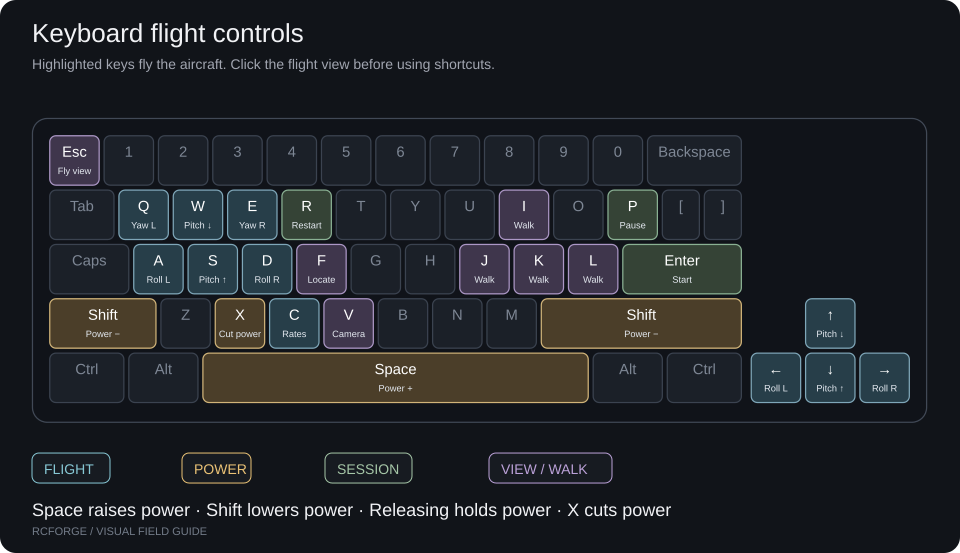
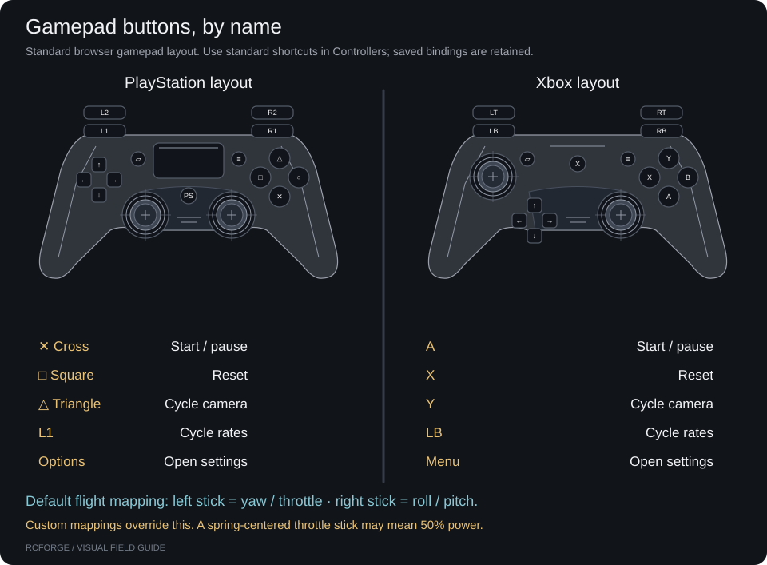

# Set up your controls

Start with a keyboard, or connect a gamepad, flight stick or RC transmitter. Open **Controllers** and select the input type you want to use.

| Your input               | Start here                                                        |
| ------------------------ | ----------------------------------------------------------------- |
| Keyboard                 | [Learn the keys](#keyboard) — no connection or calibration needed |
| Gamepad or joystick      | [Connect and calibrate](#gamepad-or-joystick)                     |
| FlySky or other RC radio | [Choose a connection](radio-setup.md) before mapping channels     |

If a device is missing or input stops, use [troubleshooting](troubleshooting.md).

## Keyboard

Click the field before flying, or click the keyboard drawing on Controllers to test the keys.

| Keys           | Action                                                   |
| -------------- | -------------------------------------------------------- |
| W / S or ↑ / ↓ | Nose down / nose up                                      |
| A / D or ← / → | Roll left / right; rudder steering on the Simple Trainer |
| Q / E          | Yaw left / right                                         |
| Space / Shift  | Raise / lower throttle; release to hold it               |
| X              | Cut throttle                                             |
| Enter / P / R  | Start or resume / pause / reset                          |
| V / F          | Change camera / locate aircraft                          |
| C              | Cycle control response                                   |

You can also use +/− or keypad +/− for power: tap for 5% steps or hold for a continuous change. Walking mode gives WASD to the pilot; arrows remain available for flight. The on-screen key diagram follows the selected aircraft.

VTOL shortcuts appear only for a VTOL aircraft. **H** sets VTOL throttle to 50%; it does not enable a fixed-wing autopilot. Switching aircraft hides unavailable actions without deleting saved bindings.

Buttons, menus and text fields keep normal keyboard behavior. If the input bar says **Editing controls**, click the field or press **Esc** to close flight setup. Losing window focus pauses flight and clears held keys.

## Flight setup

Choose the active source under **Fly → Flight setup → Input**. Mapping and calibration appear once hardware is available; a missing device shows connection steps and **Use keyboard for now**. Selecting the same device type keeps the current assignments and calibration in progress.

For launch position, cameras and pilot movement, use [views and flight setup](flight-guide.md).

## Gamepad or joystick

### Connect

1. Connect through USB or Bluetooth and confirm the operating system sees the device.
2. Focus RCForge and move a stick or press a button. Some browsers wait for interaction before exposing a controller.
3. Select the device on Controllers. Refresh devices if needed.

### Map the four flight controls

For roll, pitch, yaw and throttle, choose an axis or click **Detect**, then move only that axis within ten seconds. Use **Reverse** if the direction is wrong.

Selecting an occupied axis swaps the complete bindings, including their physical calibration. Quick-swap buttons exchange roll/yaw or pitch/throttle. Check the live monitor after a swap.

### Calibrate

1. Center roll, pitch and yaw. Capture neutral; throttle does not need to center.
2. Start range capture. Sweep every control through its full travel, including throttle low and high.
3. Check the captured endpoints, then save. **Cancel & restore** returns to the profile from before calibration. Flight stays blocked while calibration is active.
4. Verify that the centered axes return near zero and throttle reaches 0–100%.

### Tune the feel

Open **Response** on a channel to adjust dead zone and expo. Dead zone removes small center noise; expo softens the center response. Throttle uses endpoints only. Avoid applying expo twice if your transmitter already supplies it.

Check throttle before launch. Reset applies calculated elevator trim; set the visible aircraft trim to zero if you want all trim supplied by the transmitter.

Profiles are stored in browser storage keyed by device ID. Recalibrate when device IDs, adapter mode, transmitter mixes or endpoint settings change. Browser storage failures leave the active profile usable but unsaved.

## FlySky FS-i6

Start with the [visual radio connection guide](radio-setup.md), including a copyable prompt for help with your exact hardware.

See the [FS-i6 wiring and Arduino guide](flysky-fs-i6.md) for the original transmitter's trainer output, receiver PPM, or six receiver PWM channels. It includes the Uno/Nano sketch, upload steps, receiver failsafe setup and troubleshooting.

A compatible PPM-to-USB **joystick** adapter uses **Find devices**. A classic Nano/Uno running the RCForge bridge uses **Connect Arduino** in the RC transmitter tab, with a Web Serial-capable browser. A programming cable alone does not provide simulator input. Serial disconnects do not silently switch to another controller or resume flight.

## Physical acceptance checklist

Trainer-to-Nano reception has user-supplied diagnostic evidence, but receiver connections and complete flight acceptance remain unverified. Record your device, adapter, firmware, OS and browser as you check:

- [ ] Device appears and remains connected.
- [ ] Four independent channels are exposed with smooth motion.
- [ ] Axis assignments and reversal match stick intent.
- [ ] Pitch/roll/yaw centers return to zero; throttle reaches 0–100%.
- [ ] Saved calibration reloads correctly.
- [ ] No unwanted double expo or transmitter/software trim interaction.
- [ ] Disconnect pauses flight; reconnect requires deliberate resume.
- [ ] Device swap does not silently reuse incompatible calibration.
- [ ] A complete launch, turn, glide and reset is usable at normal frame rate.

The Arduino bridge shares the same mapping and calibration path as HID controllers. It accepts the documented RCForge serial protocol only; arbitrary USB serial or iBUS devices cannot be plugged in as if they were joystick adapters.

## Save or transfer a setup

Export/import under **Aircraft trim & profile files** transfers a profile JSON. An import is attached to the selected device and requires its available axes. Verify directions before saving. Unsaved changes are marked beside the device selector.

## Controller shortcuts

Choose the **Shortcuts** tab to assign Start/pause, Restart, Pilot/chase/FPV, Cycle control response, or Settings to a button or an unused axis endpoint. Standard gamepads use PlayStation/Xbox button names; custom adapters retain one-based hardware numbers. The live diagram and pressed-button indicator help identify inputs. Analog flight axes are reserved and cannot trigger shortcuts. Move a switch back before triggering its next action. Holding a button does not repeatedly restart, and connecting with a switch already on does not trigger an action.

For settings navigation assign Next setting, Previous setting, Activate, Decrease and Increase. Focus is outlined; decrease/increase adjusts selected numeric fields or dropdowns. Next/previous can reach all three flight setup tabs; Activate opens the focused tab. Navigation stays inside an open aircraft catalog or guide; focus wraps between its visible controls, and flight commands wait until the dialog is closed. Decrease/increase skips unavailable dropdown options. Shortcuts are stored separately per device in this browser. They do not change transmitter firmware or hardware menus. Leave controls unassigned if the USB adapter does not expose enough inputs. A four-axis simulator adapter may expose no spare switches or buttons.

## Flight reference display

See [the flight reference panel](flight-guide.md#read-the-flight-reference-panel) for the attitude indicator, minimap and pilot/aircraft markers.

## Response and movement tests

Use [FPV and control setup](fpv-and-control-setup.md) for adjustable response curves, per-aircraft defaults, live servo motion and surface mixers. New standard gamepad shortcuts assign L1/LB to response cycling; existing saved bindings are retained.
