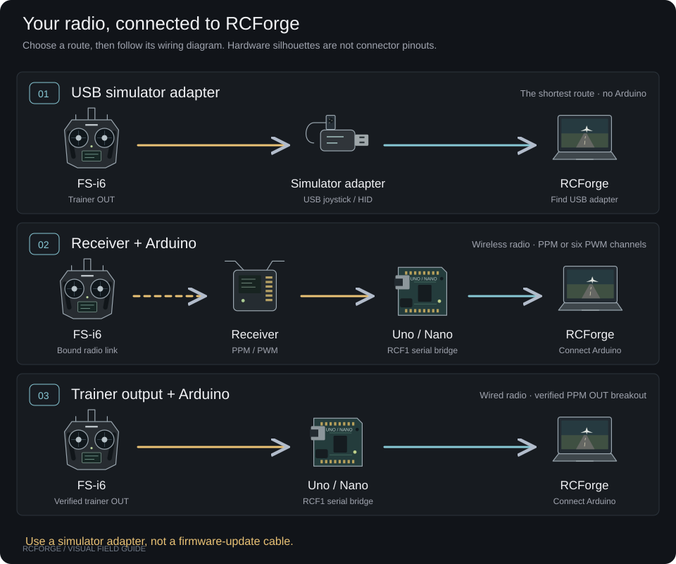
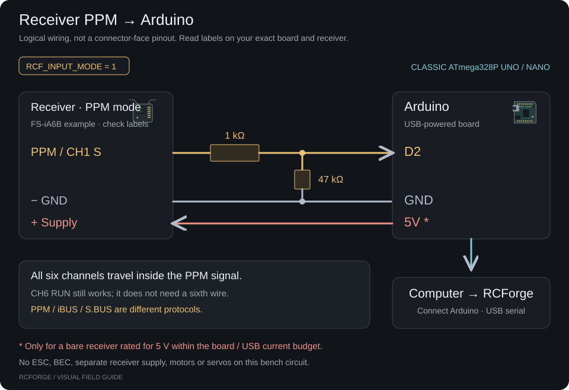
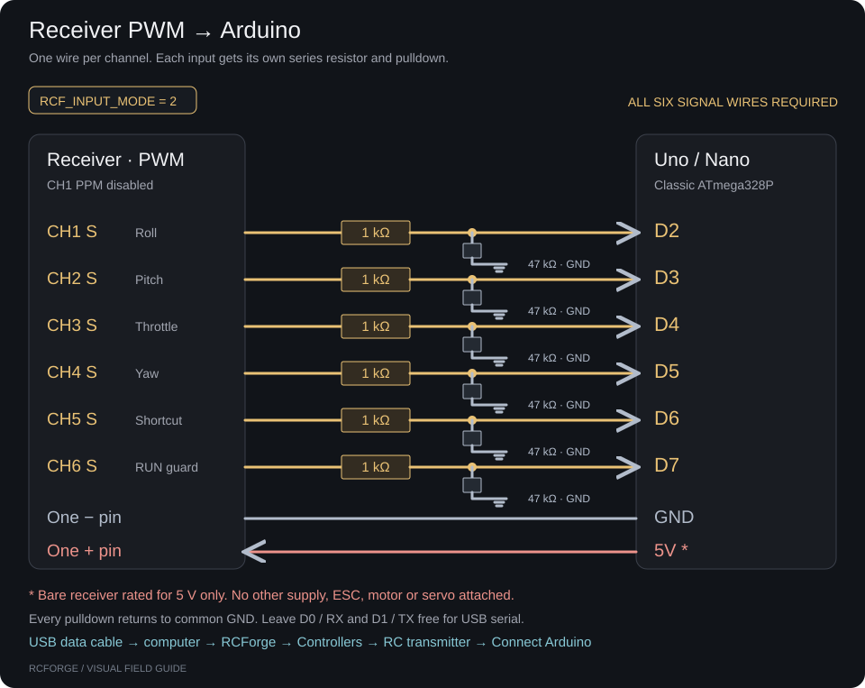
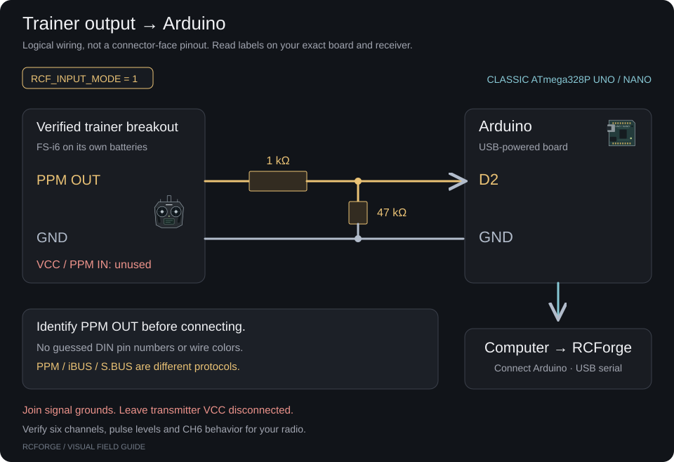
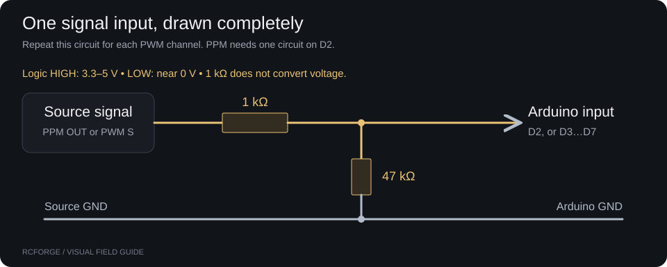
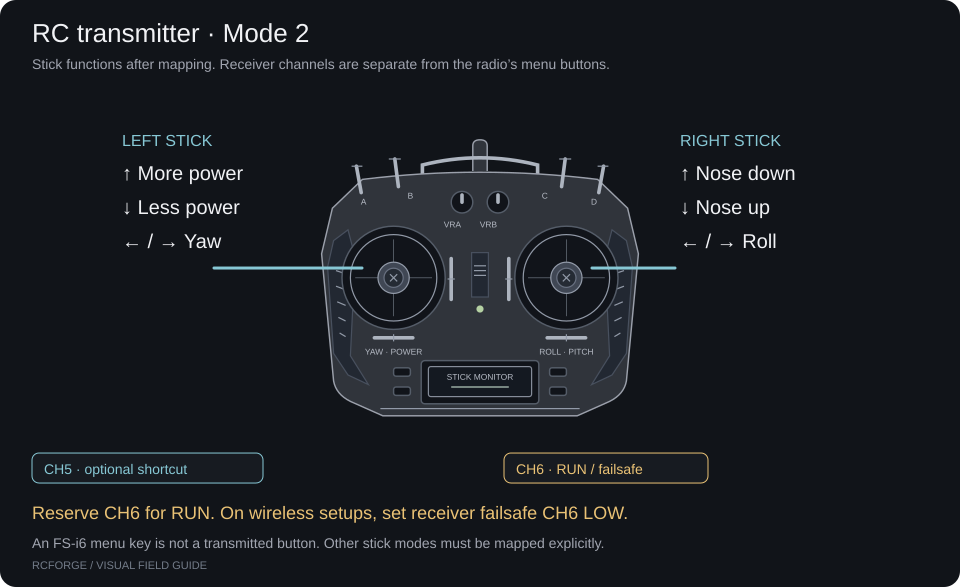
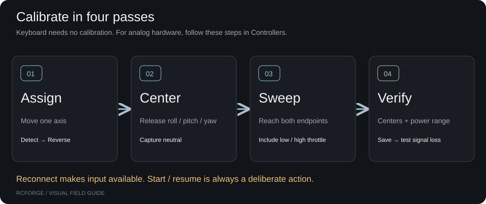

# Connect a radio

Choose a path, follow its wiring, then verify the controls. These diagrams describe
the **original FlySky FS-i6** and **classic ATmega328P Uno R3 / Nano**. Other
receivers, boards and cable pinouts need their own checks.



| Your hardware                             | Start here                                          |
| ----------------------------------------- | --------------------------------------------------- |
| Compatible USB simulator joystick adapter | [USB adapter](#1-usb-joystick-adapter) — no Arduino |
| Bound receiver with PPM output            | [Receiver PPM](#2-receiver-ppm) — one signal wire   |
| Bound receiver with CH1–CH6 PWM outputs   | [Receiver PWM](#3-receiver-pwm) — six signal wires  |
| Documented trainer PPM OUT breakout       | [Trainer PPM](#4-trainer-ppm) — wired to the radio  |

Need help with your exact parts? [Configure a prompt for your coding agent](#set-up-with-an-ai-agent).
The [detailed FS-i6 reference](flysky-fs-i6.md) includes troubleshooting and protocol details.

Have an **FS-i6, FS-iA6B and classic Nano**? Follow the [step-by-step bench guide](fs-i6-ia6b-nano-setup.md), including binding, resistor wiring, upload and the CH6 RUN switch.

## Connection test status

| Route                                   | Evidence and remaining checks                                                                                                                                                                               |
| --------------------------------------- | ----------------------------------------------------------------------------------------------------------------------------------------------------------------------------------------------------------- |
| **FS-i6 trainer → Nano**                | User-supplied diagnostic output shows six-channel PPM and changing stick values; CH6 RUN was reported. Full RCForge calibration and signal-loss/recovery are not yet confirmed.                             |
| **FS-iA6B receiver → Nano (PPM)**       | **Still to be tested successfully.** An attempted bench connection caused the USB port to disappear when the transmitter linked. The cause is unresolved; do not describe this route as hardware-validated. |
| **Receiver → Uno/Nano (six PWM wires)** | **Still to be tested on hardware.** Firmware compilation is not a physical connection test.                                                                                                                 |
| **USB simulator adapter**               | Documented option; no adapter hardware test is recorded here.                                                                                                                                               |

The sketches compile for classic Uno/Nano. The trainer evidence does not validate receiver power, binding or RF failsafe. Start with the [trainer walkthrough](trainer-nano.md) for the connection demonstrated so far.

## 1. USB joystick adapter

Use an adapter documented for the **FS-i6 trainer output** that presents itself as
a USB **joystick**. A firmware-update cable will not work for this route.

1. Power the FS-i6 from its own batteries. Connect its trainer output to the adapter, then plug the adapter into USB.
2. Follow the adapter's trainer/student-mode instructions. Create a dedicated simulator model without elevon/V-tail mixing.
3. Open **Controllers → RC transmitter → Find USB adapter**, select the device and calibrate.

No sketch is required. Only switches actually exposed by the adapter can become
simulator shortcuts; the FS-i6 menu buttons are not sent over the radio.

## 2. Receiver PPM

Use a separate, bound receiver on the bench. The **FS-iA6B** is one example with
PPM output and a documented supply range that includes 5 V. In the FS-i6's
**RX setup → PPM Output**, select PPM and hold **CANCEL** to save. This changes
CH1 from a single PWM channel to the combined PPM signal; confirm your receiver's
labels. [FS-i6 manual, §8.2](https://raw.githubusercontent.com/flysky-rc/FLYSKY-ProductInformationDownload/master/Transmitter/FS-i6/FS-i6%20User%20manual%2020240110-EN.pdf).



- **S / PPM → 1 kΩ → D2**, with **47 kΩ from D2 to GND**.
- Receiver **− → GND**. Receiver **+ → 5V** only under the supply conditions shown.
- Select **`RCF_INPUT_MODE 1`**. All six channels, including the CH6 RUN guard, travel over the single PPM signal.

A port marked **iBUS**, **SENS** or **S.BUS** is not PPM. The current sketch reads
PPM or PWM; it does not decode those other protocols.

## 3. Receiver PWM

Use CH1–CH6 servo outputs and disable PPM output if it was enabled. Every signal
needs its own resistor pair. All six channels must be present.



| Receiver signal | Arduino pin | Initial function        |
| --------------- | ----------- | ----------------------- |
| CH1 S           | D2          | Roll                    |
| CH2 S           | D3          | Pitch                   |
| CH3 S           | D4          | Throttle                |
| CH4 S           | D5          | Yaw                     |
| CH5 S           | D6          | Optional shortcut       |
| CH6 S           | D7          | RUN / receiver failsafe |

Select **`RCF_INPUT_MODE 2`**. Join one receiver **−** to Arduino GND and use the
same bare-receiver power conditions as the PPM route. Leave D0/RX and D1/TX free.

## 4. Trainer PPM

See the [rear-socket drawing and Nano diagnostic walkthrough](trainer-nano.md) for a closer view and a sketch that displays the incoming channels.

This route connects the transmitter directly to the Arduino. Start with a breakout
whose **PPM OUT** and **GND** contacts are documented for your exact FS-i6 cable.
The drawing uses signal names, not guessed DIN pin numbers or wire colors.



Select **`RCF_INPUT_MODE 1`**. Leave VCC and PPM IN disconnected. The transmitter
uses its own batteries; USB powers the Arduino. Confirm six-channel PPM output and
which physical control becomes CH6, especially in student mode. If the pinout is
unknown, use a labeled receiver output or a documented simulator adapter.
See the [trainer limitations](flysky-fs-i6.md#using-your-uno-or-nano), including the
narrow wired-only exception when CH6 is unavailable.

## Build each input circuit



Use one circuit for PPM or six for PWM. The 47 kΩ resistor connects **after** the
1 kΩ resistor, at the Arduino input. Signal HIGH must be **3.3–5 V**, LOW near
0 V. A resistor does not convert higher or negative voltages.

For a USB-powered bench receiver, verify that its supply rating includes **5 V**
and its current fits the board/USB budget. The FS-iA6B is rated **4.0–8.4 V**.
Connect no ESC, BEC, other supply, motors or servos to this circuit.
[FlySky receiver specifications](https://www.flysky-cn.com/ia6b-canshu).

## Load the bridge and connect

Download the version-matched [RCForge bridge sketch](../hardware/rcforge_bridge/rcforge_bridge.ino),
or open it in your cloned project. Keep the file inside a folder named `rcforge_bridge`.

1. In Arduino IDE, set **`RCF_INPUT_MODE`** to 1 for PPM or 2 for PWM. Keep **`RCF_GUARD_CHANNEL 6`**.
2. Select **Arduino AVR Boards → Arduino Uno** or **Arduino Nano → ATmega328P** and your board's USB port. Upload using a USB data cable.
3. Close Serial Monitor. In desktop Chrome, open RCForge on localhost or HTTPS.
4. Choose **Controllers → RC transmitter → Connect Arduino**, select the serial port, and allow the board to reboot.

Classic Nano clones may need **ATmega328P (Old Bootloader)**. This sketch is not
for Uno R4 or Nano Every. It sends **USB serial** into RCForge, not a system-wide
USB joystick. [Uno R3](https://docs.arduino.cc/hardware/uno-rev3/),
[classic Nano](https://docs.arduino.cc/hardware/nano/),
[Web Serial](https://developer.chrome.com/docs/capabilities/serial).

## Verify RUN, then calibrate

For receiver routes, assign **CH6 to a two-position switch**: high is RUN, low is
STOP. Set receiver failsafe **CH6 low**, throttle low and centered controls. In the
FS-i6 failsafe menu, **Off means hold the last output**, which will not reliably
signal a lost radio link. [FS-i6 manual, §8.4](https://raw.githubusercontent.com/flysky-rc/FLYSKY-ProductInformationDownload/master/Transmitter/FS-i6/FS-i6%20User%20manual%2020240110-EN.pdf).





1. In RUN, verify four independent controls. Use Detect and Reverse as needed, then capture neutral and full travel.
2. Save and check centered roll/pitch/yaw and **0–100% throttle**. Lower throttle before starting.
3. For receiver routes, turn the transmitter off: live input must stop and flight must pause. If it stays live, fix receiver failsafe before relying on it.
4. Verify signal removal and USB removal also pause flight. Reconnect, check the controls, and resume deliberately.

The drawings and pin assignments are checked against the sketch and manufacturer
references. **Physical wiring, USB drivers and your receiver's failsafe still need
bench verification.** No connected hardware is claimed by these guides.

## Set up with an AI agent

Fill in your hardware on the website, then **Copy prompt**. In the Markdown file,
replace the `{{…}}` fields yourself. Paste it into your coding agent inside an
RCForge checkout. The agent can inspect code and prepare board-specific commands;
you make the physical connections and operate the radio.

```agent-prompt
Help me connect my RC controller to RCForge in this checkout.

Connection route: {{Connection route|Receiver PPM|Receiver PWM (six channels)|Trainer PPM|USB joystick adapter}}
Board: {{Arduino board|Uno R3 (ATmega328P)|Classic Nano (ATmega328P)|Classic Nano (Old Bootloader)|None — USB joystick adapter|Other or unsure}}
Transmitter: {{Transmitter model and firmware}}
Receiver or adapter: {{Receiver or adapter model}}
Computer: {{Operating system and browser}}
Cable / breakout information: {{Cable labels or pinout link}}

Read AGENTS.md, docs/radio-setup.md, docs/flysky-fs-i6.md and hardware/rcforge_bridge/rcforge_bridge.ino first. Treat the current checked-out firmware as authoritative. Ask for missing model names, clear connector photos or manufacturer pinouts. Never guess DIN pin numbers from wire colors or assume a USB programming cable is a joystick adapter.

For my chosen route, produce a labeled connection table with source pin, resistor, board pin, common ground and power arrangement. PPM uses D2; six-channel PWM uses CH1–CH6 to D2–D7. Each input needs 1 kΩ in series and 47 kΩ to ground on the Arduino side. Verify signal voltage and receiver supply requirements from primary sources. Do not join USB 5 V to an ESC/BEC or another supply. Use a bare bench receiver without motors or servos.

For Arduino, prepare exact compile commands for my board and input mode, keeping CH6 RUN guard enabled on receiver routes. Classic Nano bootloaders differ. Use the existing RCF1 bridge; do not replace it with a generic serial sketch. List ports, but do not choose a port or upload without my explicit selection and instruction. For a USB joystick adapter, skip firmware and explain Find USB adapter instead of Connect Arduino. If my board or protocol is unsupported, explain that before proposing changes.

Guide me through radio setup with simulator mixing disabled, CH6 high RUN / low STOP, receiver failsafe CH6 low and throttle low. Do not disable the guard to hide missing input. Then guide mapping, reversal, neutral/endpoints, low throttle, signal/USB loss and radio-off tests. Reconnection must require deliberate resume. Separate code/compile results from physical checks that only I can confirm. Finish with the exact wiring, configuration and unresolved checks for my setup.
```
