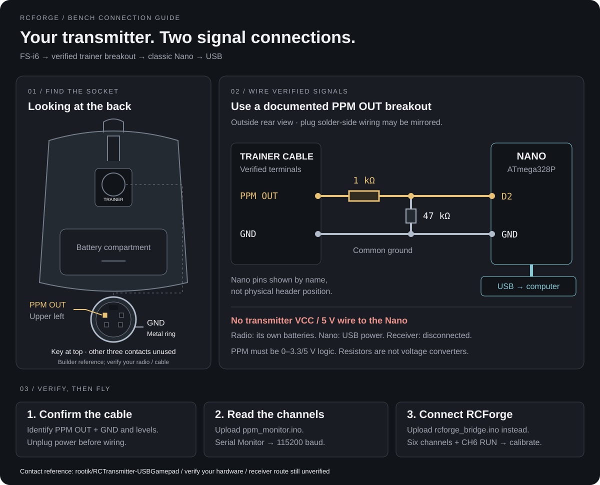

# FS-i6 trainer socket → Nano

Connect the transmitter directly to USB through your **classic ATmega328P Nano**. The receiver is not used. This guide pairs a socket illustration with a PPM diagnostic sketch and the existing RCForge bridge.



## 1. Identify the plug before wiring

The drawing shows the **socket viewed from outside the transmitter**, with the antenna above it, as in your photo. It is an orientation illustration, not a verified electrical pinout. Looking at a plug's solder side can reverse left and right.

Use an **FS-i6-compatible trainer PPM-output breakout** with documented contacts. You need only **PPM OUT and GND**. Do not insert loose jumper wires into the socket, infer a pin from wire color, or assume a physically matching S-video/PS/2 cable has the correct wiring. A firmware-update USB cable is not a PPM-to-USB joystick adapter.

The manufacturer sources checked do not establish the numbered contacts for your exact cable. A separate builder reports a working [FS-i6 trainer PPM adapter](https://github.com/rootik/RCTransmitter-USBGamepad), but that project uses a Leonardo and its D4 input; **our classic Nano sketch uses D2**. Its wiring is not proof of your cable's contact assignment.

If the cable documentation does not specify electrical levels, have PPM OUT checked with an oscilloscope and suitable probes. This circuit expects LOW near 0 V and HIGH at **3.3–5 V**, with no negative voltage. An ordinary multimeter cannot verify pulse peaks. The resistors below do not convert an unsuitable voltage.

## 2. Make the two-wire connection

Unplug USB and turn off the transmitter before wiring. Disconnect the receiver and all its wires from the Nano.

| Connection                                        | Destination                            |
| ------------------------------------------------- | -------------------------------------- |
| Verified trainer **PPM OUT**                      | 1 kΩ series resistor, then Nano **D2** |
| Nano **D2**, after the series resistor            | 47 kΩ resistor to Nano **GND**         |
| Verified trainer **GND**                          | Nano **GND**                           |
| Transmitter VCC / battery, PPM IN, other contacts | Leave disconnected                     |

Power the Nano from its USB data cable. Power the transmitter from its own batteries. **There is no 5 V connection between them.** Use the Nano pin labels: D2 is not D0/RX, D1/TX or RST. Compare the [official Nano pinout](https://content.arduino.cc/assets/Pinout-NANO_latest.pdf).

The transmitter can still emit RF while a trainer cable is attached. Keep real aircraft/ESCs powered off during simulator setup.

## 3. Upload the diagnostic sketch

Open [`ppm_monitor.ino`](../hardware/ppm_monitor/ppm_monitor.ino) inside its **ppm_monitor** folder. This sketch only reads D2; it does not drive the radio or decode unknown serial protocols.

1. In Arduino IDE choose **Arduino AVR Boards → Arduino Nano** and the appropriate ATmega328P processor/bootloader. Use Old Bootloader only if your board needs it.
2. Select the current USB serial port. Upload with the transmitter wires disconnected; reconnect only after unplugging USB.
3. Open Serial Monitor at **115200 baud**. With no signal it should keep printing `NO SIGNAL`; the USB port should remain present.
4. Turn on the transmitter using a dedicated simulator model. Follow its firmware's student/PPM-output setting if required. Trainer input mode and receiver PPM settings are not equivalent to trainer output.
5. Move one stick at a time, then each knob/switch. Identify the changing channel rather than assuming an assignment. Student mode can bypass normal model settings.

Example output only, not captured from your hardware:

```text
PPM | channels=6 | CH1=1500 | CH2=1500 | CH3=1000 | CH4=1500 | CH5=1500 | CH6=1900 | bridge guard: RUN
```

| Monitor output               | Meaning / next step                                                                                                                       |
| ---------------------------- | ----------------------------------------------------------------------------------------------------------------------------------------- |
| `NO SIGNAL`                  | No recent rising edges. Check verified output, ground, cable and transmitter output mode.                                                 |
| `EDGES, NOT VALID PPM`       | Edges exist but do not form a supported fresh PPM frame. Check the actual waveform/protocol.                                              |
| `PPM`, 6 channels            | Candidate input for the RCForge bridge. Check every channel, direction and endpoint.                                                      |
| `PPM`, another channel count | The monitor can inspect 4–12 channels; the existing bridge requires exactly six. Do not silently discard extras.                          |
| `bridge guard: STOP`         | CH6 is at or below 1700 μs. Find the physical control sent as CH6 and set RUN above that value.                                           |
| USB port disappears          | This is a USB/power/hardware problem, not an ordinary missing-PPM report. Disconnect the trainer wiring and resolve it before continuing. |

Intervals are measured between rising edges, with a sync gap over 3000 μs and channel intervals of 800–2200 μs. Values commonly fall near 1000–2000 μs. The monitor prints four times a second. Its built-in LED indicates a fresh valid diagnostic frame, even if CH6 is STOP; this differs from the guarded bridge LED.

## 4. Upload the RCForge bridge

The monitor prints readable diagnostics; **RCForge cannot use those lines as flight input**. Once six-channel PPM is verified, open [`rcforge_bridge.ino`](../hardware/rcforge_bridge/rcforge_bridge.ino) in its matching folder and upload it instead. No extra Arduino libraries are required.

Leave these settings enabled:

```cpp
#define RCF_INPUT_MODE 1
#define RCF_GUARD_CHANNEL 6
```

Set the physical CH6 control above 1700 μs for RUN, below it for STOP. If student mode provides no usable CH6 control, read the narrowly scoped [wired-trainer exception](flysky-fs-i6.md#using-your-uno-or-nano) before changing the guard. Do not apply that exception to a wireless receiver.

1. Serial Monitor at 115200 should show `RCF1` packets. Status `1` means six fresh channels and guard RUN; `0` means STOP or invalid input.
2. Close Serial Monitor. Open RCForge in desktop Chrome on localhost or HTTPS.
3. Choose **Controllers → RC transmitter → Connect Arduino**, select the Nano, then map and calibrate the four flight controls.
4. With throttle low, test STOP and transmitter power-off. Input must become unavailable and flight must pause. Restoring the signal must not resume flight automatically.

## Sources and verification

- [FlySky FAQ, simulator connections](https://www.flysky-cn.com/0enfaq): PPM simulator adapter options.
- [FS-i6 manual, student mode](https://raw.githubusercontent.com/flysky-rc/FLYSKY-ProductInformationDownload/master/Transmitter/FS-i6/FS-i6%20User%20manual%2020240110-EN.pdf): transmitter settings; not a verified cable pinout.
- [Arduino Nano pinout](https://content.arduino.cc/assets/Pinout-NANO_latest.pdf): board pin names.

The SVG is an original schematic illustration. Both sketches are compile-checked for classic Uno, Nano and Nano Old Bootloader by `bash scripts/check-arduino.sh`. Compilation does not verify your cable pinout, electrical levels or physical hardware behavior. The diagnostic sketch is not a calibrated measuring instrument.
